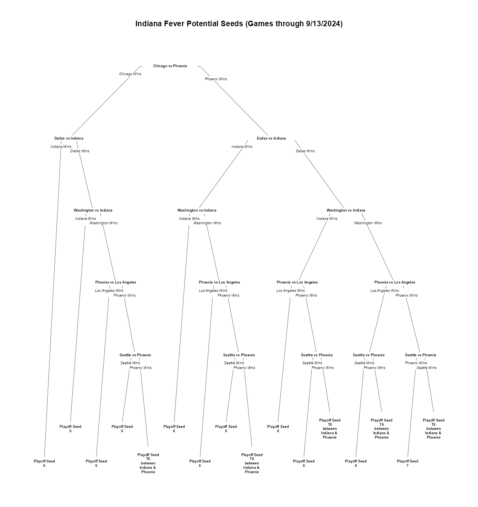
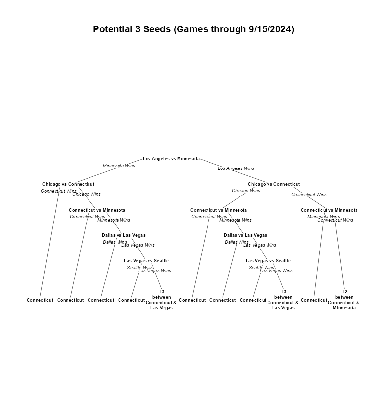
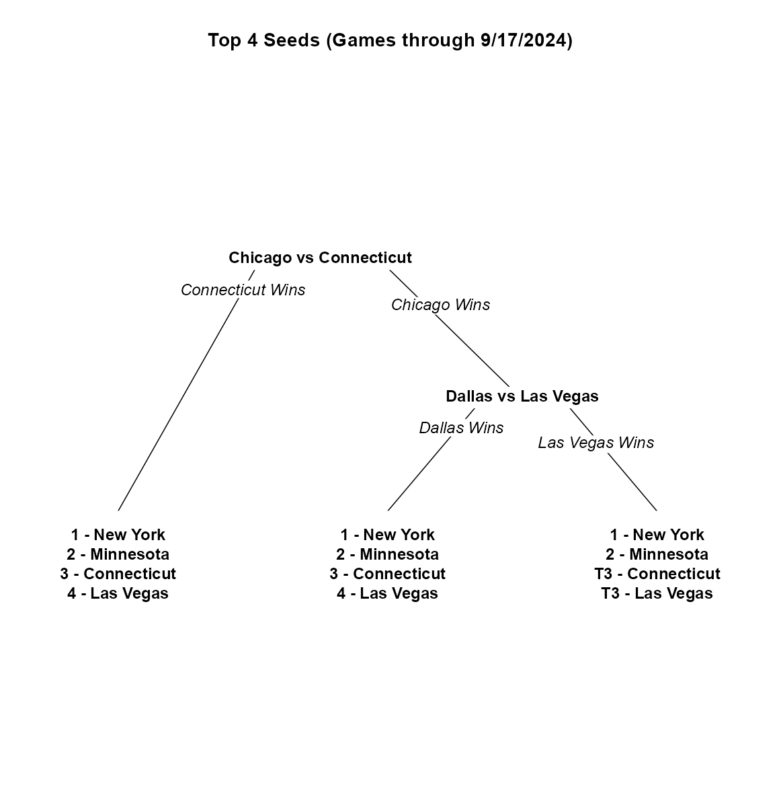

## Background

In 2024, I was the data analyst for the Indiana Fever. As the season progressed, it became increasingly clear that we were going to make the playoffs for the first time in almost a decade. We finally clinched with around 3 games remaining in the season. Naturally, our focus shifted to the playoffs and who our potential opponents were going to be. I did several magic number calculations and had it down to 2 teams, however it wasn't until a conversation with Fever Broadcaster Pat Boylan that we realized there was a 3rd scenario where we possibly would be going to Vegas as well. Knowing these possibilities are critical for all parties involved in sports - coaches want to know what teams to scout, operations coordinators need to know for which cities they need to make travel plans, network television wants to have contingency plans for where to send their different broadcast teams. For us in Indiana, we luckily had it figured out a few days before the last game of the season, but it was likely possible to know much earlier that. This post describes the systematic process of finding out all the possible scenarios through a framework I've called "Scenario Trees

## What is a Scenario Tree?

Borrowing a concept from combinatorial game theory, a game tree represents all possible game states. Game trees have nodes representing decision points and edges which are the outcomes of those decisions. These edges eventually end with terminal or leaf nodes. For our case, the game trees have nodes representing head to head matchups, the edges represent the outcome of those matchups and the terminal nodes are the resulting seeds. Since these game trees display the results with regards to seeding given a scenario of games, I have decided to call them "scenario trees".

The examples below are all from the 2024 WNBA season. As will be explained later, the further from the end of the season, the more possible scenarios exist. Therefore, to make sure everything fits on a singular graphic, different scenario trees are produced for visualization purposes

## Types of Scenario Trees

When looking at the applications of such a project, three types of questions from potential stakeholders come to mind immediately:

1)  What is the projection for our team?

2)  Who are we projected to play against, given that we know (approximately) where we are seeded?

3)  What's the big picture look like? Given a particular scenario, what would the final standings look like?

### Team Projection Trees

Returning to the Indiana Fever for a moment, the first question asked by the coaching staff was introspective - where are we projected. In the WNBA Playoff Format during the 2024 Season, the Top 4 Seeds received home court advantage in Games 1 and 2 of the First Round. By using a Team Projection Tree, we are able to see how the results of other games directly impact the Fever with our terminal nodes being the Fever's end of season ranking given a certain outcome of games. Unfortunately, by this point in the season, the Fever was locked out of the Top 4 and would be traveling on the road for games 1 and 2 of the first round.

### Seed Projection Trees

Now that we knew Indiana was headed on the road for the first round, the next logical question is where are the going. By using Seed Projection Tree, we can find all teams that possibly could have been the 3 seed - the team a 6 seed would be facing in a 8 team bracket. As correctly deduced by Pat Boylan, there were 3 possible teams that Indiana could face in the first round: the Minnesota Lynx, the Connecticut Sun, and the Las Vegas Aces.

### Big Picture Trees

As mentioned previously, in the WNBA the top 4 seeds have home court advantage in the first round of the playoffs. Having a scenario tree that shows the larger picture of who is in the host conversation is valuable for network television when determining what time games should be played. Teams that finished with a better record should be rewarded with a game time that best fits their local timezone. For example, a west coast team such as the Las Vegas Aces should be rewarded for their success and play at a time that fits better than the Seattle Storm who finished with a worse record but is still in the same timezone

## How It Works Combinatorically

A user inputs the scores of all relevant[^1] games played as well as the scheduled games remaining with the scores of those games left blank. Then, all possible combinations of winners of the games yet to be played are considered. This means, by adding a singular game, the number of possible scenarios increases exponentially - the number of possible scenarios doubles.

[^1]: "Relevant" meaning related to how the final standings are determined. For example, in the WNBA all games are relevant. However, when determining seeding for the ACC Championship, only ACC matchups are considered

From there, the current standings are calculated from the data to serve a reference point. Then, for each possible scenario, the new results are calculated based on the given outcomes of the games for that scenario. Those predicted records are then combined with the records from games that have already occurred to produce a team's standings for the entire season given the scenario. Finally, teams are ranked by win percentage and other columns such as "potential 3 seeds" or "top 4 seeds" are then derived from there.

One of the drawbacks of this process is computational intensity: the further we try to project into the future, the longer the process takes to produce a scenario tree. In fact, given enough unknown games, the creation of a given scenario tree may take longer than it takes games to actually be played. However, given the number of games a team plays in a season, teams typically are not looking much beyond a magic number calculation until the end of the regular season.

## Creating Trees

At this point in the Scenario Tree Process, our information is in the form of a data frame or spreadsheet with 2Number of Games Remaining rows. For a smaller number of games remaining, this is manageable for a human to filter through every row to find possible "must-happen game" results for a given seeding/outcome to occur. To clarify, a "must-happen game" is a game where a particular outcome "must happen" for the desired seeding outcome to occur. However, with as few as 7 games, a human must sort through over 100 possible combinations of game results to identify these must-happen games. With 10 games remaining, the number of possible game results inflates to over 1000. Thus, this process should be done algorithmically.

Several unsupervised machine learning methods, such market basket analysis, were tested while trying to determine which games were must-happen games. However, the best solution actually involved a decision tree classification model. In traditional decision tree models, the model is typically fit so that it can adapt to new data that is inputted. This is to prevent overfitting to training data. However, when using a decision tree model to create a scenario tree, new values in a potential testing set is not something we have to worry about because all possible combinations of game results have been explicitly enumerated. To account for this, the complexity parameter (cp) of the decision tree model was set to essentially 0. The complexity parameter of a decision tree model is a threshold by which a model's R2 value must increase for it to be included in the model. If by adding a split, the complexity parameter threshold is not reached, the split is not included in the model and the decision tree has finished growing. By setting this value to as close to 0 as possible, the model will continue to grow as deep as possible which would prevent misclassifications. Again, since we have perfectly enumerated data, we are not worried about overfitting - in fact, that would be ideal - because we are not trying to "predict" what the seed would be because we've explicitly calculated would it would be given a set of game results.

The 2 minor drawbacks of using a decision tree model to find these must-happen games is we lose chronology. The games most relevant to the desired seeding are at the top of the scenario tree rather than the games that occur first. The other flaw is that decision trees are grown with binary splits. For sports where opponents only meet once per season like football, this is fine. However, in other sports where teams play more than 1 time, there are more than 2 possible scenarios. For example, if the teams play 2 times in a given schedule, a given team could go 2-0, 1-1 or 0-2. To combat this, the decision tree model lumps multiple outcomes into 1 edge and then splits those outcomes closer to the terminal node where the final seding id revealed.

## Use Cases

As alluded to earlier, the value of Scenario Trees are endless. What is unique about this process is its applicability across all sports and even to other non-sporting competitions. By inputting final scores, scenario trees can be created for any head to head competition, not just basketball. When creating this project, my test case was Alabama High School Football - using these Scenario Trees to figure out who my hometown team would be playing in the first round of the playoffs. Similar to the background story with the Fever, having an idea of how playoffs are projecting even just a few extra rounds of competition early can become a massive advantage to operations directors who may be scheduling travel and video coordinators trading opposing teams' scouts.

Alternatively, rather than looking ahead for the most likely scenario, [a member of the Sickos Committee](https://sickoscommittee.org) would likely look for the less likely scenarios. Of course, upsets of any magnitude but also scenarios of ties between a large number of teams. Due to the nature of different leagues and sports, tiebreakers are not calculated within Scenario Trees - teams are simply listed as tied in the standings. Given the extensive enumeration of all possible scenarios, a path to even the most unruly of scenarios can be found.
