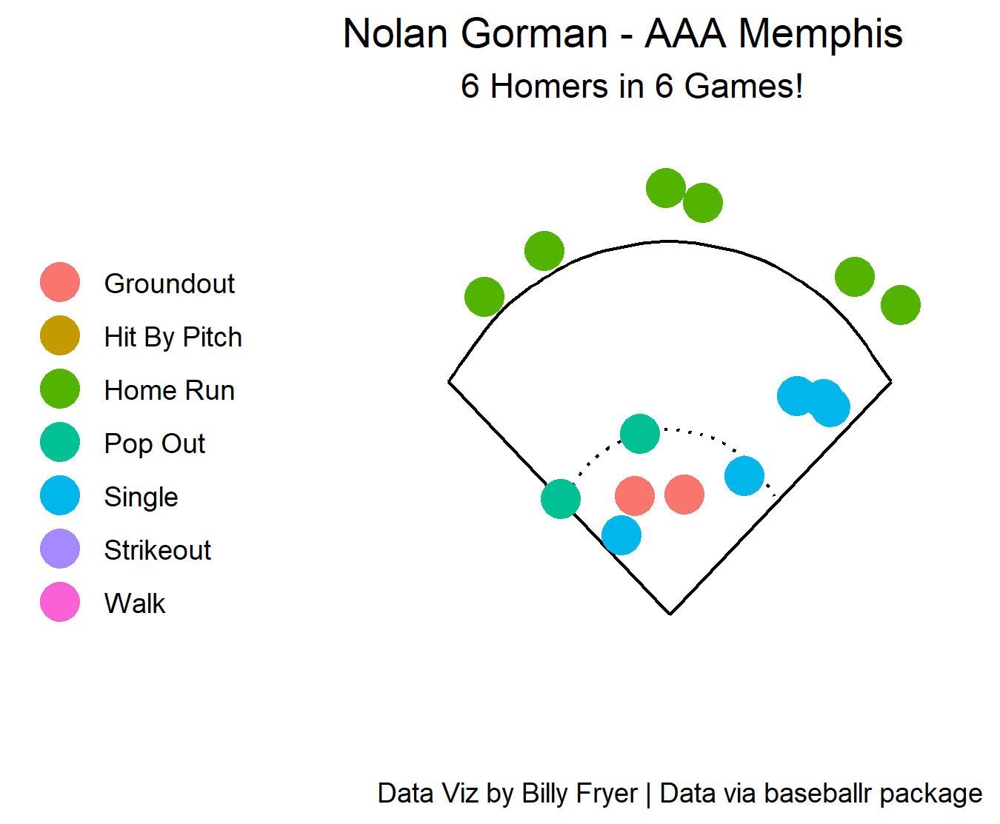
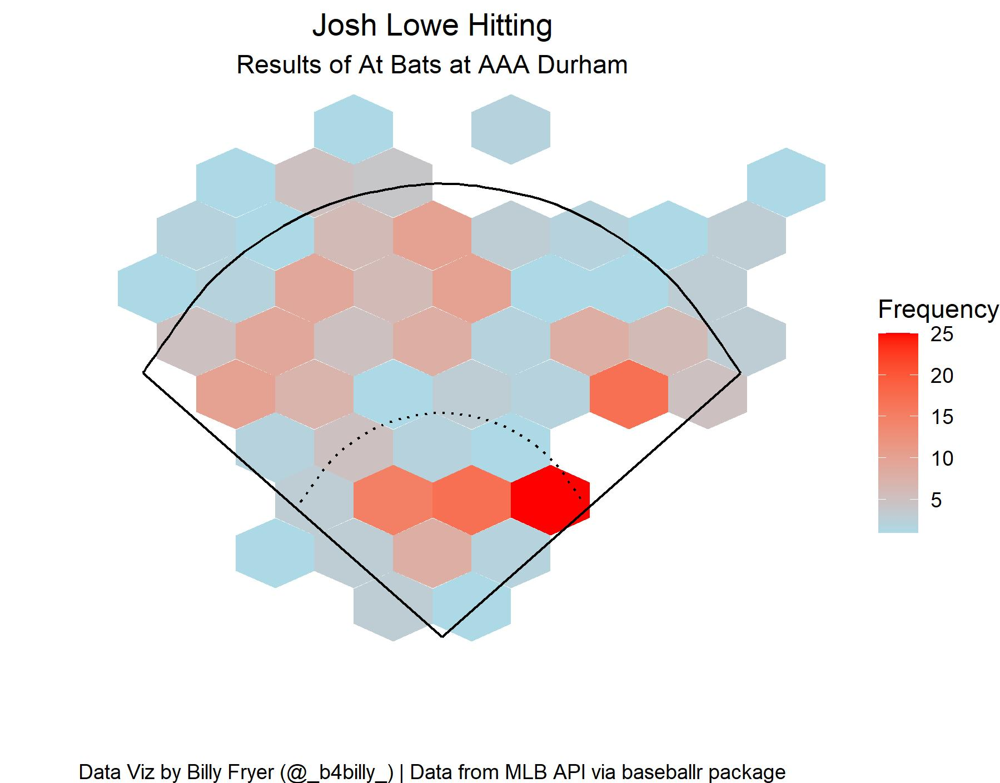
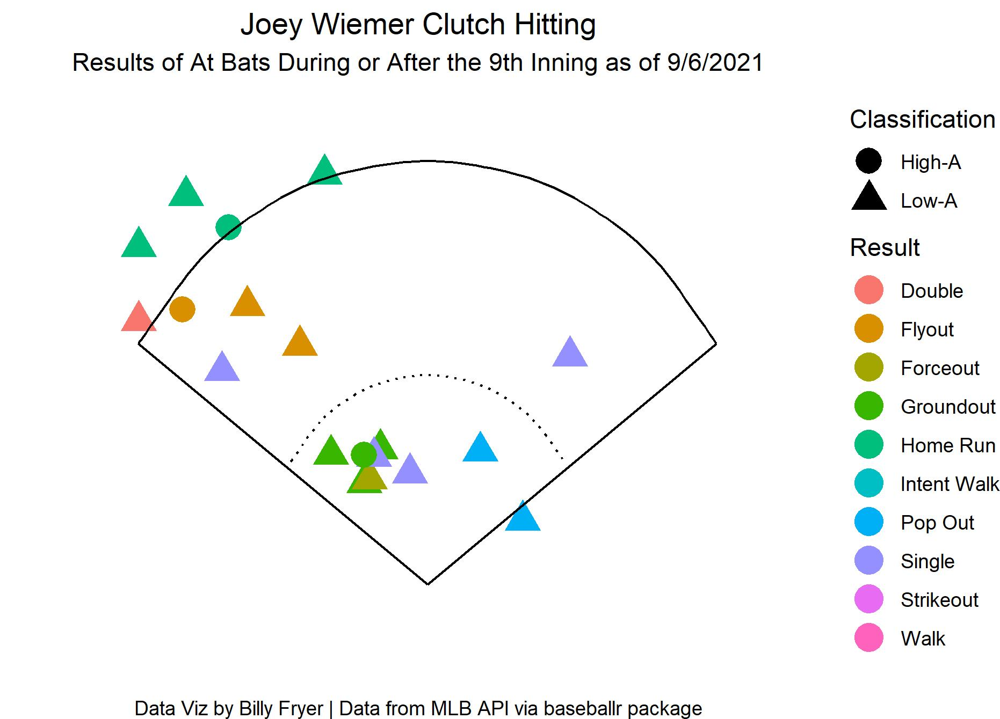

# Nolan Gorman Home Run Streak
## April 18, 2022

Cardinals Prospect Nolan Gorman is on an incredible streak of 6 home runs in 6 games! Gorman is currently at AAA Memphis and his streak covers multiple series including opponents Charlotte (AAA CWS) and Gwinnett (AAA ATL) including a 4 day home run streak according to Tyler Maun of milb.com

# Josh Lowe Callup
## October 13, 2021

At last, Tampa Bay calls up prospect Josh Lowe from AAA Durham. With solid pop in his bat, he would prove to be a nice addition to their team as they headed towards the 2021 Playoffs

# Joey Wiemer Clutch Hitting
## September 6, 2021

Joey Wiemer is a highly ranked prospect in the Milwaukee Brewers system. During his final series at (then) Low A Carolina, he proceeded to go out with a bang over the weekend hitting 3 homers in 3 days including 2 walk off home runs in Extra Innings as well as a grand slam for the other home run. Upon promotion to High A Wisconsin, he continued his hot streak to finish the 2021 MiLB Season. He competed in the 2021 Arizona Fall League and starting the 2022 Season in AA Biloxi.
