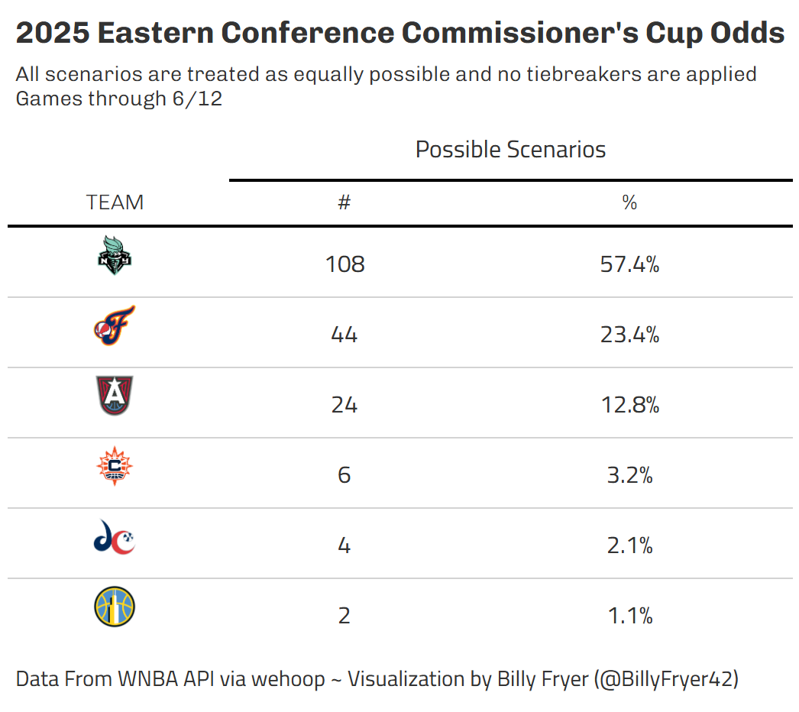
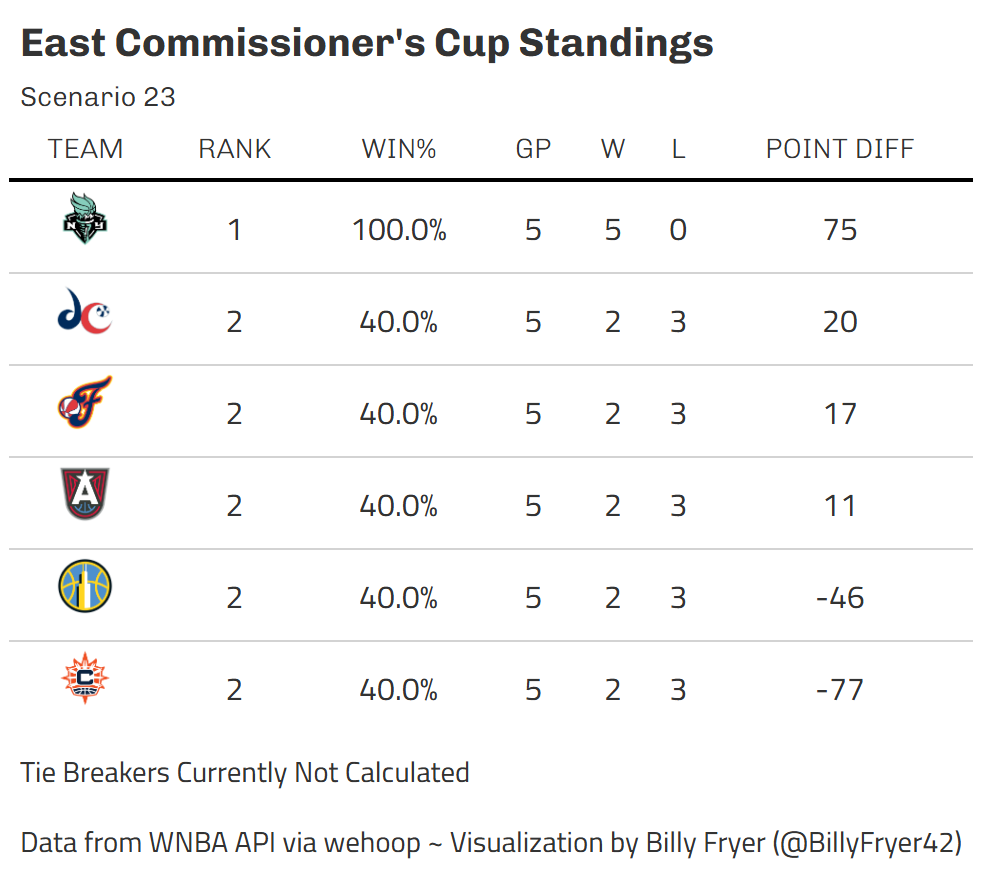
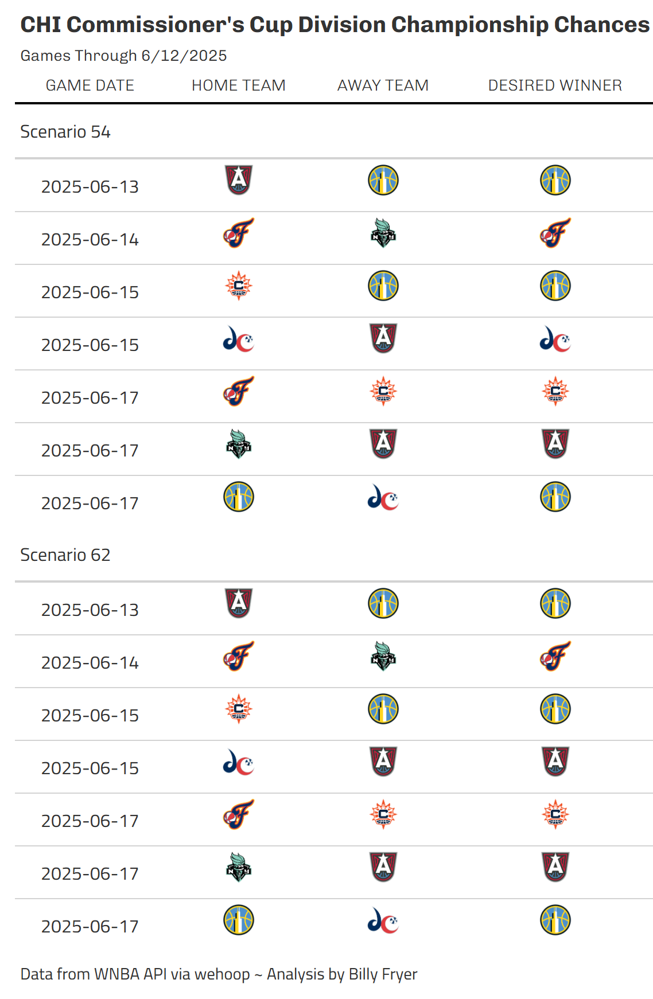
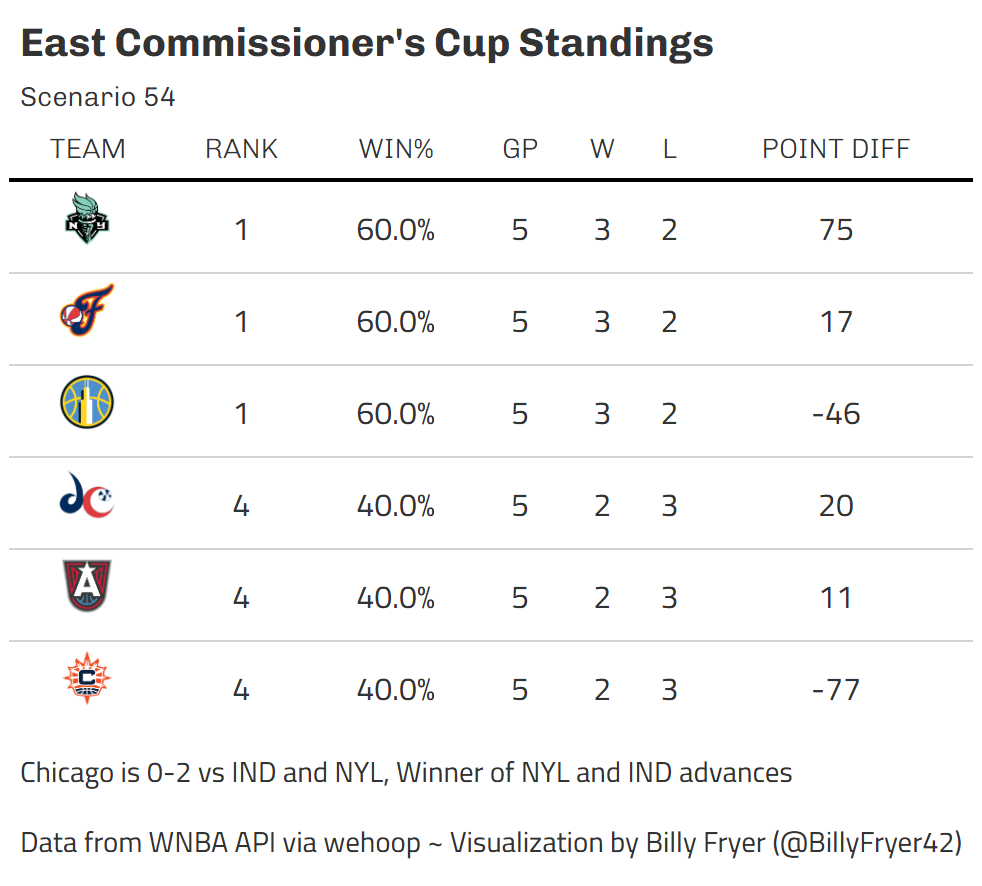
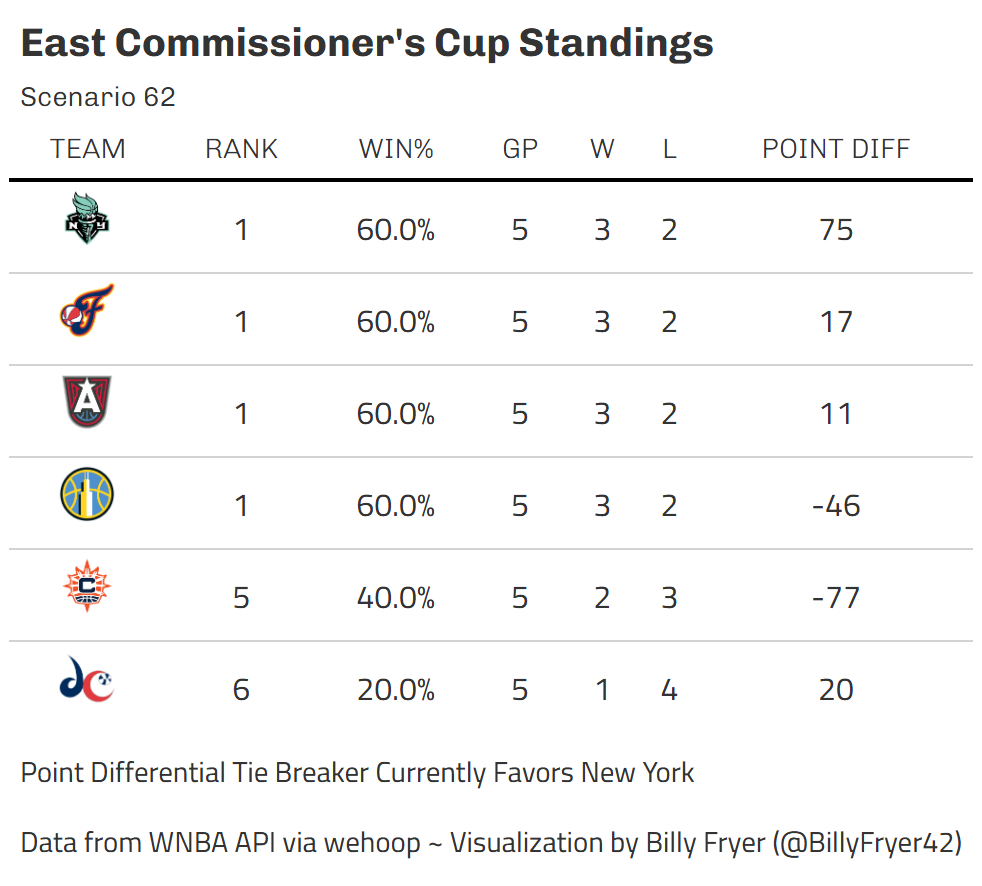
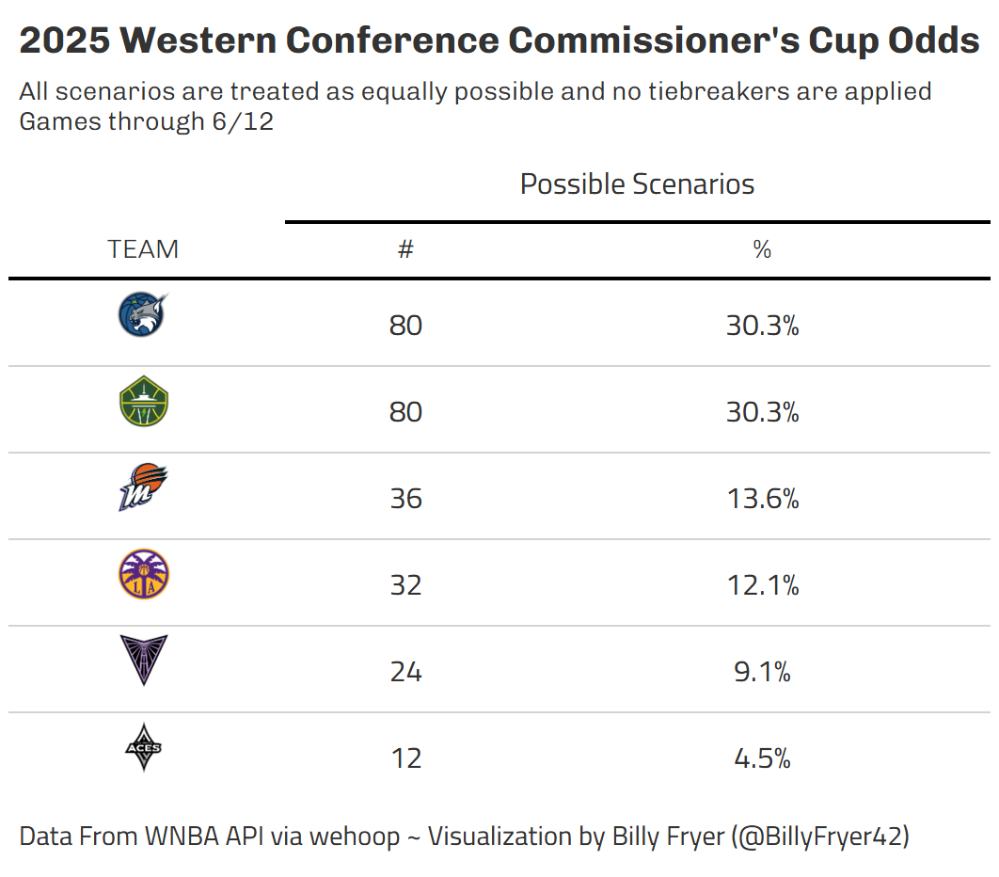
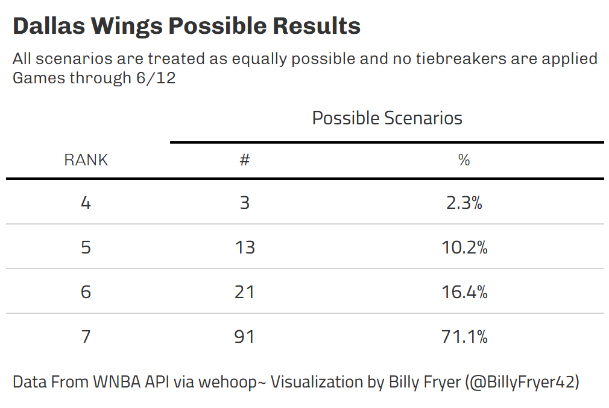

The WNBA's Commissioner's Cup is halfway through and the race is on to see which 2 teams will face off in the Commissioner's Cup Championship on July 1. I was able to map out where teams stand given their games played so far and games remaining and wanted to share some unique findings. As more games are played, I'll continue to post updates on Twitter/BlueSky about tie breakers!

*Note:* When scenarios are referred to by numbers, the numbers have no significance. Scenario numbers were randomly assigned. For example, Scenario 1 is no more likely to happen than Scenario 2.

# Eastern Conference

As of right now, New York seems to have a stronghold on the Eastern Conference Commissioner's Cup race. In the remaining scenarios, they are at least tied for first in over 50% of all possible outcomes. After more games are played, tiebreakers become slightly easier to calculate. However, they have their toughest stretch of this competition coming up with a looming away game at Gainbridge Fieldhouse in Caitlin Clark's return from injury game against the Indiana Fever and a home game on June 17 against a hot Atlanta Dream. In the case of a 3 way tie (NYL beats ATL, IND beats NYL and all teams beat WAS, CON and CHI), it will come down to point differential. Unfortunately for New York, their blowout wins versus Chicago and Connecticut would not help them as the WNBA Commissioner's Cup Tie Break rules say only games between the teams that are tied are included in the tie breaker.

## Chaos Scenario

My favorite scenario to find would involve a 5 way tie for 2nd place in the east. This assumes New York stays undefeated, beating everyone else in the Eastern Conference, and the other teams involved in the tie go 2 and 2 against the rest of the conference. Of course, the Commissioner's Cup only cares about the team in first place, so New York would advance on to the Commissioner's Cup Championship, but very large ties are always fun to see.

## Chicago Sky

Based on the Commissioner's Cup Odds table above, there are 2 scenarios where Chicago ends up tied for first before tie breakers are applied. The table below shows how the results of games yet to be played need to finish out for Chicago to be in the hunt for their first Commissioner's Cup Championship Appearance.

### Scenario 54

Unfortunately, this scenario isn't going to pan out for Chicago because they have already played and lost to both Indiana and New York, placing them at the bottom of the 3 team tiebreak. However, tied for first is still something to hang their hats on.

While technically still possible, it's highly unlikely that Scenario 62 works in Chicago's favor as well. In this scenario, all 4 teams tied have beaten Connecticut and Washington and go 1-2 against all teams that are tied. From there, the tie breaker is combined point differential in games among teams that are tied. While technically still possible, Chicago has an inconceivable hole to dig out of because of their 19 point loss to New York and 27 point loss to Indiana. Winning this tie breaker would require a historic blowout win over Atlanta and close match ups in the other relevant remaining games between New York, Indiana and Atlanta. 

# Western Conference

The race for the Western Conference is on! As it stands right now, Minnesota and Seattle seemingly have pretty even odds to end up as Western Conference Commissioner's Cup Champions. However, it is important to note that Seattle does have the Head-to-Head Tie Breaker over Minnesota due to their impressive win on June 11. Of note in that game, it appeared that Kayla McBride took exception to Erica Wheeler's layup as time was expiring. With the tie breakers as they currently stand, that layup potentially could have an impact in a 3 way tie scenario between Minnesota, Seattle and likely either Phoenix or Los Angeles.

## Dallas Eliminated

Unfortunately, one team is missing from the Western Conference race as Dallas has already been eliminated from the competition after their 0-4 start in the competition. They can finish no higher than 4th in the West. Looking at their remaining games, they have already faced the toughest part of the conference with match ups against Golden State and Las Vegas remaining.
