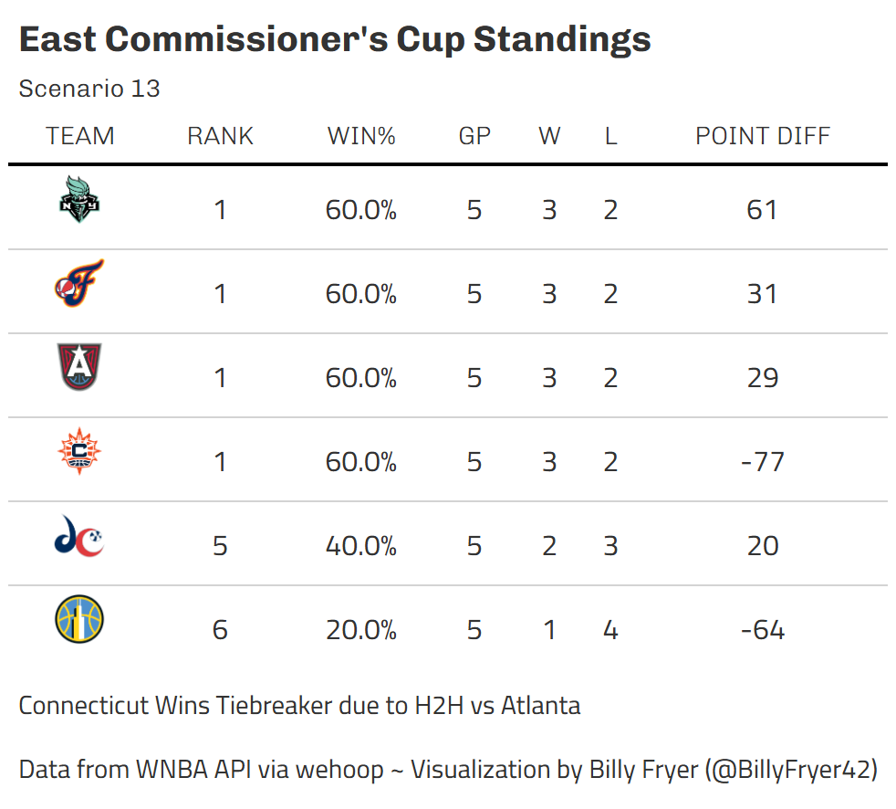
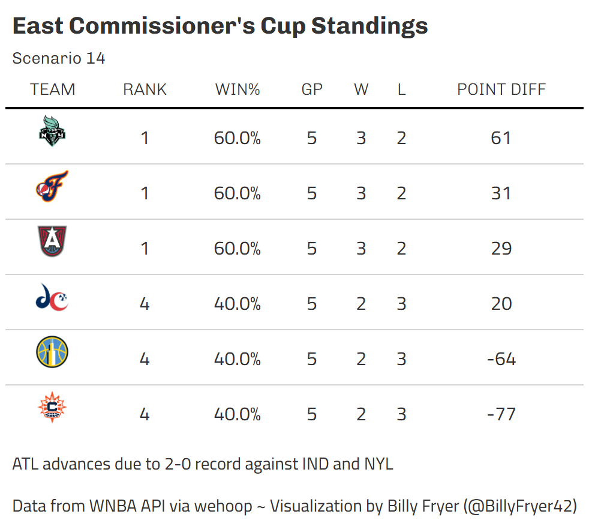
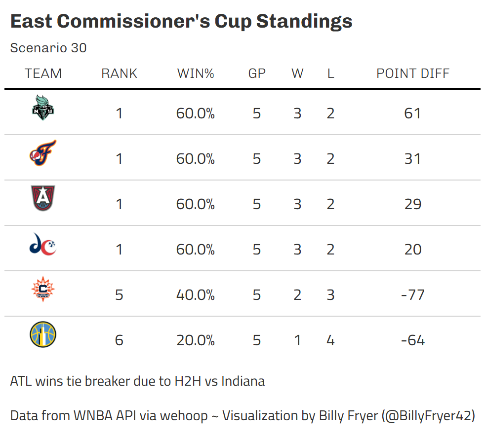
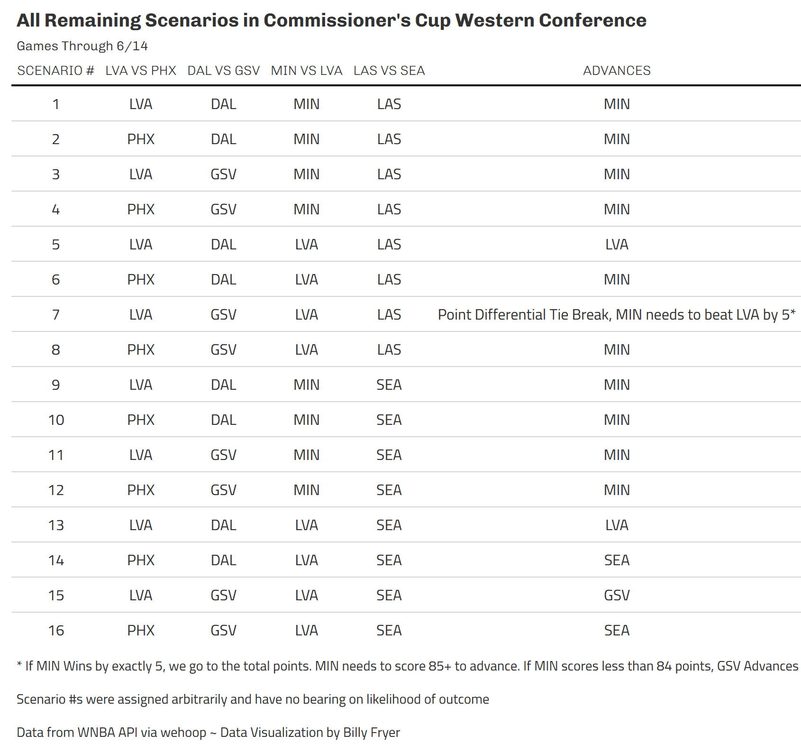
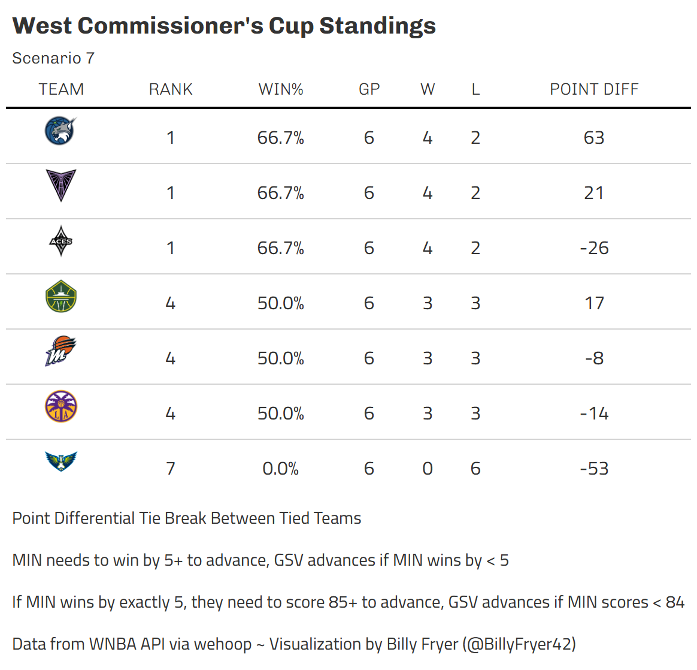

Tons of games this Saturday with big time implications. Indiana's defeat of New York has vaulted them into the lead in the Eastern Conference. Out West, Seattle was in the driver's seat but fell to a Golden State Valkyries team that fought through short handedness with several key players out due to EuroBasket. Below are updates on where we're at!

*Note:* When scenarios are referred to by numbers, the numbers have no significance. Scenario numbers were randomly assigned. For example, Scenario 1 is no more likely to happen than Scenario 2.

# Eastern Conference

With a win already in the books over Indiana, if the Atlanta Dream beat the New York Liberty and Washington, they will advance to their first Commissioner's Cup Championship Game! 

If the Indiana Fever beats CON and ATL loses to NYL or WAS, Indiana will advance. Given their strong performance today versus New York and the return of Caitlin Clark, the game versus Connecticut feels like it should be rather easy. Indiana just needs a little bit of assistance by either Washington or (more likely) New York.

The third mostly likely team to qualify for the Championship are the New York Liberty. They only have 1 match up left in the Commissioner's Cup against Atlanta and it's a must win. However, they also need Connecticut to upset Indiana which seems like a much taller task. Connecticut beat Indiana a few weeks earlier at Gainbridge, so it's not entirely out of the question, just unlikely

That leaves us with 4 situations that will need tiebreakers scenarios as shown

## Scenario 13

Of the possible scenarios remaining, this is my favorite. We end in a 4 way tie between New York, Indiana, Atlanta and Connecticut. The first tie breaker is win percentage against teams that are tied. In this scenario, Atlanta and Connecticut end up 2-1 while New York and Indiana are 1-2. That means our next tie breaker is the head to head match up between Atlanta and Connecticut which Connecticut did win. For completion's sake, Indiana defeating New York gave them third place in this scenario.

## Scenario 14

Of these tie breaker scenarios, this is as simple as it goes. Atlanta has wins over both New York and Indiana (their losses being to Washington and Connecticut) meaning they win the head to head tie breaker over both teams they are tied with.

## Scenario 30

Scenario 30 plays out in a similar fashion to scenario 13 but involves Washington instead of Connecticut. Looking at games between only those 4 teams, Indiana and Atlanta end up 2-1 and Washington and New York end up 1-2. From there, Indiana beat Atlanta head to head and advance.

# Western Conference

The Western Conference has actually had more games played which makes our scenarios a little bit easier to follow. 

The Las Vegas ACes advance with wins over PHX and MIN *and* DAL beating GSV 

The Seattle Storm advances with win vs LAS, LVA beating MIN, and PHX beating LVA

The Valkyries need all 4 games to have a specific outcome to advance. Check out the table below to see those!

Otherwise, the Minnesota Lynx advances

## Scenario 7

As always, there's always that one scenario that doesn't pan out as planned. Golden State, Las Vegas and Minnesota are in a 3 way tie deadlocked against one another, each with 1 win and 1 loss. The point differential tie break is applied to only games between those tied teams and with 2 games being played already, we can calculate Minnesota needs to beat Las Vegas by more than 5. If they win by less than 5, Golden State advances.

That of course leads to the natural questions of what if Minnesota beats Las Vegas by exactly 5. Then we'd go to the next tie breaker which is points scored in Commissioner's Cup Games among teams that are tied. Golden State scored 95 versus the Aces and 75 vs the Lynx for a combined total of 170. Las Vegas scored 68 against the Valkyries and Minnesota scored 86. If we subtract Minnesota's 86 from the 170 total points Golden State scored, we find that Minnesota needs to score 85+ to clinch that tie breaker. If they score less than 84, Golden State advances. And if they score exactly 84... well, I'll leave that as an exercise to the reader.

