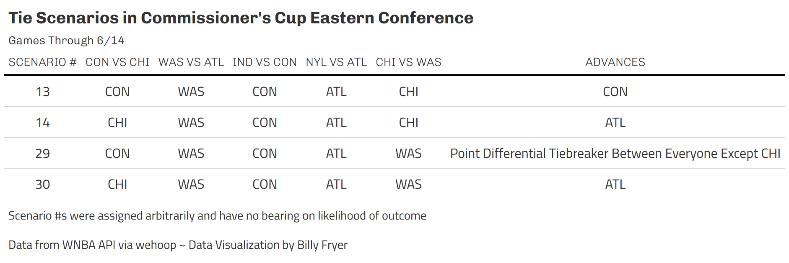

Tons of games this Saturday with big time implications. Indiana's defeat of New York has vaulted them into the lead in the Eastern Conference. Out west, Seattle was in the driver's seat but fell to a Golden State Valkyries team that fought through short handedness with several key players out due to EuroBasket. Now control has shifted back over to the reigning Commissioner's Cup Champions the Minnesota Lynx. Below are updates on where we're at!

*Note:* When scenarios are referred to by numbers, the numbers have no significance. Scenario numbers were randomly assigned. For example, Scenario 1 is no more likely to happen than Scenario 2.

# Eastern Conference

With a win already in the books over Indiana, if the Atlanta Dream beat the New York Liberty and Washington Mystics, they will advance to their first Commissioner's Cup Championship Game! 

If the Indiana Fever beats Connecticut and Atlanta loses to New York or Washington, Indiana will advance. Given their strong performance today versus New York and the return of Caitlin Clark, the game versus Connecticut feels like it should be rather easy. Indiana just needs a little bit of assistance by either Washington or (more likely) New York.

The third mostly likely team to qualify for the Championship are the New York Liberty. They only have 1 match up left in the Commissioner's Cup against Atlanta and it's a must win. However, they also need Connecticut to upset Indiana which seems like a much taller task. Connecticut beat Indiana a few weeks earlier at Gainbridge Fieldhouse, so it's not entirely out of the question!

That leaves us with 4 situations that will need tiebreakers scenarios as shown

## Scenario 13

Of the possible scenarios remaining, this is my favorite. We end in a 4 way tie between New York, Indiana, Atlanta and Connecticut. The first tie breaker is win percentage against teams that are tied. In this scenario, Atlanta and Connecticut end up 2-1 while New York and Indiana are 1-2. That means our next tie breaker is the head to head match up between Atlanta and Connecticut which Connecticut won back on June 6. This means the Connecticut Sun is alive and still fighting for a spot!

## Scenario 14

Of these tie breaker scenarios, this is as simple as it goes. New York, Indiana and Atlanta are in a 3 way tie, but Atlanta has wins over both New York and Indiana (their losses being to Washington and Connecticut) meaning they win the head to head tie breaker over both teams they are tied with.

## Scenario 30

Scenario 30 plays out in a similar fashion to scenario 13 but involves Washington instead of Connecticut. Looking at games between only those 4 teams (NYL, IND, ATL, WAS), Indiana and Atlanta end up 2-1 while Washington and New York end up 1-2. From there, Indiana beat Atlanta head to head and advance to the Commissioner's Cup Championship.

# Western Conference

The Western Conference has actually had more games played which makes our scenarios a little bit easier to follow. 

The Las Vegas Aces advance with wins over both Phoenix and Minnesota They do need a bit of help from the Dallas Wings though with Dallas needing to beat Golden State. With the trade of Li Yueru to Dallas, the Wings now have a more serviceable, true center. If she can adapt to Koclanes' system quickly, I could see Dallas making that match up interesting.

The Seattle Storm's situation got a lot harder after their loss to Golden State. They must win against the Los Angeles Sparks. Then, they need Las Vegas to beat Minnesota and Phoenix beating Las Vegas. With the return of Kahleah Copper, I think Phoenix beating Las Vegas can happen, even with the Mercury on the road. However, Las Vegas beating Minnesota is where I see this situation falling apart.

The Valkyries need all 4 games to go in their favor. First and foremost is a win over Dallas. They then need Las Vegas to beat both Phoenix and Minnesota. Finally, it would be preferred if Seattle to beat Los Angeles, otherwise we go to further tiebreaks as explained late. Although it requires a lot of moving part, the potential for this to happen is absolutely real. On any given day, Las Vegas could revert back to their 2022-2024 self and pull off what would be an upset in 2025. If Jewell Loyd plays up to her potential offensively, we could be in for a surprise.

In any other scenario not mentioned, the Minnesota Lynx advances. It seems at this point that their game against Las Vegas doesn't have as strong of a pull on their future as other games yet to be played.

## Scenario 7

There's always that one scenario that doesn't pan out as planned. As previously mentioned when we were talking about Golden State's chances of advancing, it would be preferred if Seattle beat Los Angeles. However, if Los Angeles wins that match up (and both Las Vegas and Golden State win out), it turns out we have to dig pretty deep into tie breakers. This would leave Golden State, Las Vegas and Minnesota in a 3 way tie deadlocked against one another (each with 1 win and 1 loss). The point differential tie break is applied to only games between those tied teams and with 2 games being played already, we can calculate that Minnesota needs to beat Las Vegas by more than 5. If they win by less than 5, Golden State advances.

That, of course, leads to the natural question of what if Minnesota beats Las Vegas by exactly 5. Then we'd go to the next tie breaker which is points scored in Commissioner's Cup Games among teams that are tied. Golden State scored 95 versus the Aces and 75 vs the Lynx for a combined total of 170. Las Vegas scored 68 against the Valkyries while Minnesota scored 86. If we subtract Minnesota's 86 from the 170 total points Golden State scored, we find that Minnesota needs to score 85+ to clinch that tie breaker. If they score less than 84, Golden State advances. And if they score exactly 84... well, I'll leave that as an exercise to the reader.

