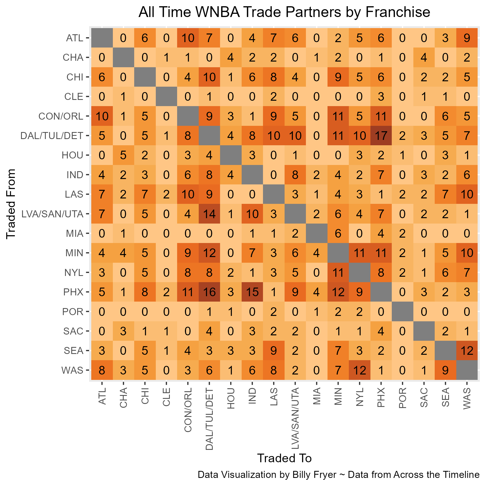
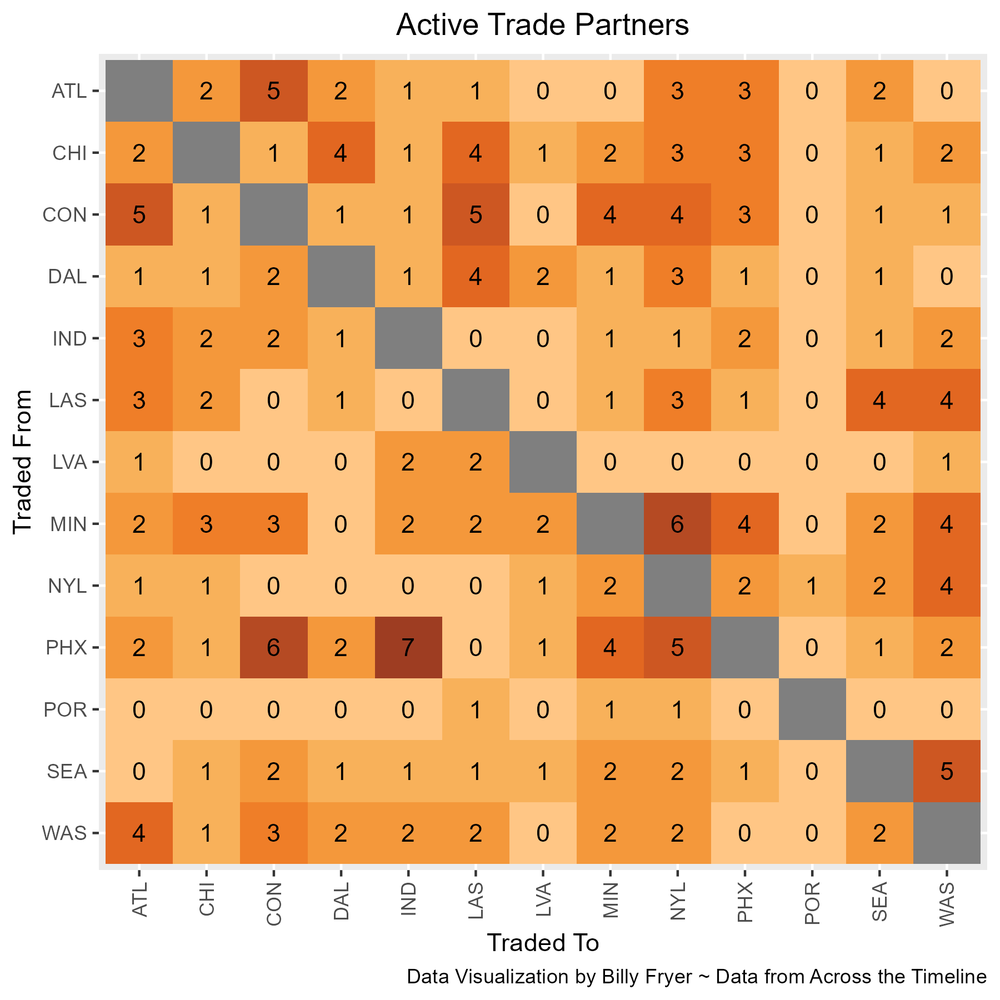
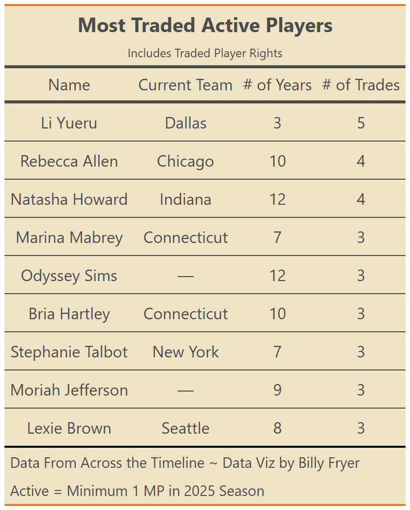
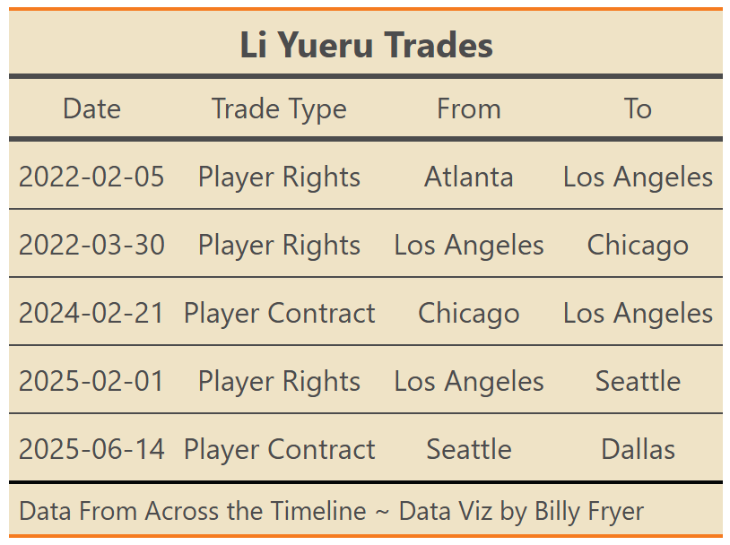

As the WNBA Trade Deadline has now officially come and gone, I wanted to take a look at some historical trade partners in the WNBA. In all of sports, teams traditionally have stronger relations with certain other teams typically in a different division, conference or league (depending on how the league is divided). In the WNBA, this effect is compounded due to the limited number of teams.

To read the heat maps below, the team on the vertical axis is the team sending something to the team on the horizontal axis. Due to the nature of multi-team trades (such as the massive 4 team trade this past offseason), a franchise may have sent more than they have received from another franchise and vice versa. For example, the Connecticut Sun franchise (including when they were the Orlando Miracle) have sent player contracts, player rights, draft picks, or other considerations (such as expansion draft protection) 10 times to the Atlanta Dream franchise.

## All-Time Trade Partners by Franchise

A great example of this phenomenon is the Phoenix Mercury. Throughout their history as a franchise, their most common trade partners are the franchise currently known as the Dallas Wings and the Indiana Fever. During their days as the Detroit Shock, the Mercury and Shock were common trade partners given the East/West pairing. As Detroit moved to Tulsa and then eventually Dallas, the Mercury have recently traded more often with Indiana also in the Eastern Conference.

## Current Trade Partners

The graph above shows the most common trade partners among franchises in their current iteration as well as Portland's previous history assuming it gets reassigned to them [just like the Charlotte Hornets](https://www.nola.com/sports/pelicans/lewis-pelicans-hornets-swap-of-names-record-books-can-cause-confusion/article_b994d7f5-abd1-596a-8ddf-b1df8796eae6.html). We see the same general trend as before - Eastern Conference Teams trading with Western Conference Teams. One of the more interesting teams in this graphic is the New York Liberty. [Outside of contributing in the original Marina Mabrey trade (where they recieved the rights to German lock-down defender Leonie Fiebich, a draft pick, and rights to swap 2025 1st Round Picks with Phoenix)](https://sky.wnba.com/news/chicago-sky-acquires-marina-mabrey-in-four-team-trade), New York has been very selective in trades - primarily making moves with the Washington Mystics. Liberty GM Jonathan Kolb is known for being very savvy with the salary cap and international signings and in his 6th season with the club, the bulk of his splashy moves to quickly turn New York into a title contender have been in those departments.

Ideally, this graph would have been by primary decision maker, whether that be GM, President or Head Coach. Depending on the organization and time, these may have even been the same person at some points. However, the WNBA is going through massive shifts. Coming into this season, [7 of the 13 teams in the WNBA have new head coaches](https://www.espn.com/wnba/story/_/id/45070948/wnba-2025-season-guide-new-coaches-trades-draft-offseason). In addition, many of these teams have new head decision makers as well. Dallas finally has a GM; Lin Dunn retired from Indiana; Connecticut, Washington and of course the newest franchise the Golden State Valkyries all had changes as well. Many teams that are returning coaches and front office members from the 2024 season don't have much continuity either - take Phoenix for example.

## Who's *Not* Trading with Whom

Inspired by [this linked tweet](https://x.com/nbacrazystats/status/1942914495719809214?s=42), I also wanted to look at teams that have not traded with one another. Summarizing the Active Trade Partners table above (and excluding Portland's past history), the following teams have neither sent nor received any assets from one another from a trade:

- Connecticut - Las Vegas (No casino trades apparently)
- Indiana - Los Angeles

## Most Traded Players

Moving on from team partners, I decided then to look at active players that have been traded the most. Not surprisingly, Marina Mabrey makes the list with her 2 notable trades whose effects are still strongly felt to this day in Chicago. Marina was originally drafted by LA before being traded to Dallas in 2020. Former Sky Head Coach and GM James Wade (now with the Toronto Raptors) then made a play for her in 2023 in a blockbuster trade in order to make the 2023 playoffs. The move paid off, Chicago did make the 2023 playoffs, but it has left their draft picks barren outside of the Angel Reese and Kamilla Cardoso picks in 2024. This original Mabrey trade is the same trade that sent Leonie Fiebich's Draft Rights from Chicago to New York. Then, in one of the biggest trade deadline moves in WNBA history, the Connecticut Sun realizing a closing playoff window traded for Marina in 2024. Unfortunately, this move did not pay off for them as well. They were able to sweep Indiana in Round 1 of the playoffs, but then fell to Minnesota in the Semifinals.

## The Most Traded Player - Li Yueru

Despite the drama of the Mabrey trades, Li Yueru from China is the player who has been traded the most of anyone in league history - active or not. She was traded twice in the 2022 offseason before even playing a season in the WNBA. Fast forwarding to 2025, the first major trade was a three team trade between Los Angeles, Las Vegas and Seattle. According to sources, all three players in the trade (Yueru, Jewell Loyd and Kelsey Plum) were unhappy in their situation and the teams swapped draft picks - including the #2 Overall Pick going from LA to Seattle - to make the trade even. However, as 2025 season has progressed, Yueru again requested a trade from Seattle. As the story was breaking, it was revealed that part of the unhappiness stemmed from her skipping the 2025 Asia Cup [on behalf of the Chinese Basketball Federation](https://www.swishappeal.com/wnba/2025/6/9/24443564/wnba-seattle-storm-li-yueru-trade-request-china-chinese-allegations-jewell-loyd-nneka-malonga-skylar). The Federation wishes for her to get more playing time which was not happening in Seattle due to that #2 overall pick turning into 19 year old French phenom Dominique Malonga. Since arriving in Dallas, Li Yueru has gotten plenty of playing time and has been a solid contribution to the Wings.

## 2025 Trade Deadline Moves

As the trade deadline has passed, it is more obvious than ever who is trying to be buyers and sellers, contenders and rebuilders. Due to the new CBA coming after the season and the related note that pretty much all veterans are due to be free agents after this season, teams that are not in playoff contention have been more than willing to part with veterans for a cheaper than usual asking price. For example, the Dallas Wings trading DiJonai Carrington to Minnesota for Diamond Miller and a 2nd Round Pick (Karlie Samuelson was also traded to Dallas for the salary cap math to work but was waived due to injury). Had this been even a year ago, Dallas probably gets a bigger haul in return. Another example of this trade was the Brittney Sykes trade from Washington to Seattle in exchange for Alysha Clark and a 2026 1st (Zia Cooke also included but was waived by Washington). Seattle and Minnesota are squarely in the "compete for the 2025 championship" category while Dallas and Washington are stockpiling future draft picks.

However, the best Trade Deadlines moves may not even be trades after all. As previously mentioned, Kolb in New York has done very well internationally and was able to sign Emma Meesseman after her EuroBasket MVP performance. On a similar note, the Indiana have done well with in-season signings, picking up Aari McDonald and more recently Chloe Bibby to add to their squad. Given the extent of Caitlin Clark's injury, these signings have been huge in holding the Fever over until she gets back and then serving as very strong depth.

**Special thanks to Tan Ho and Andrew Weatherman for helping me figure out how to pull data from Across the Timeline.**