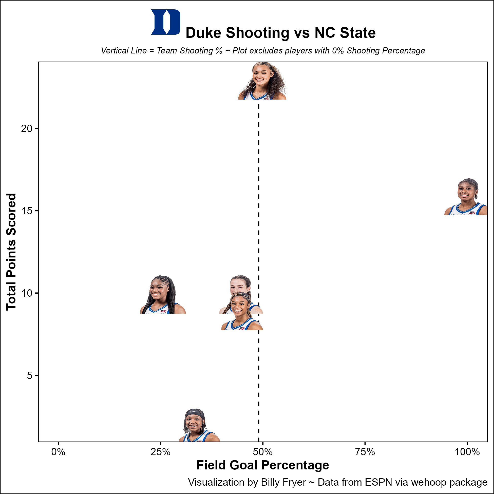
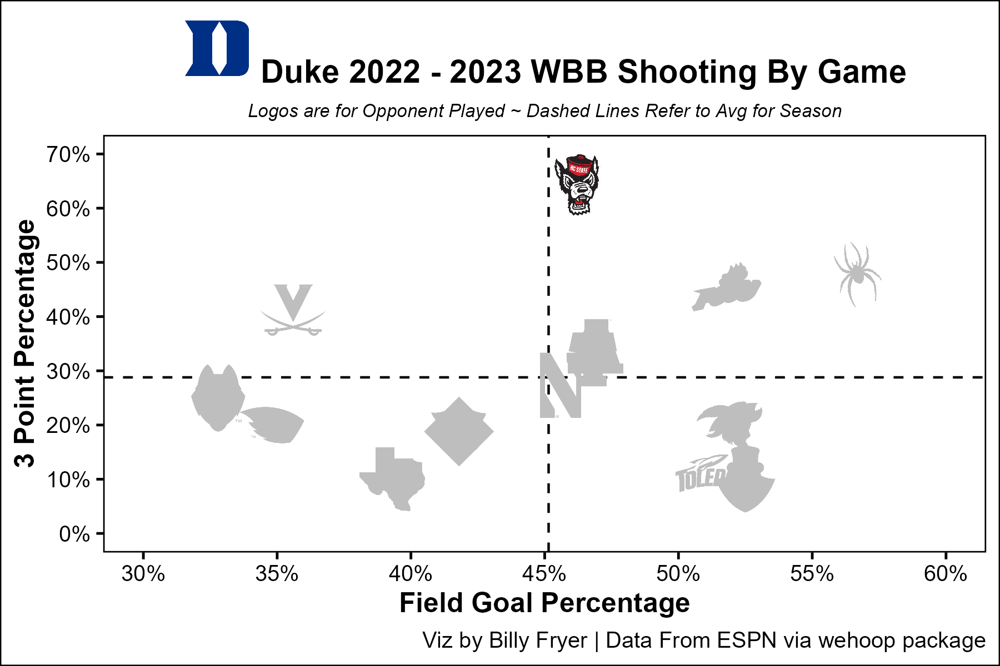
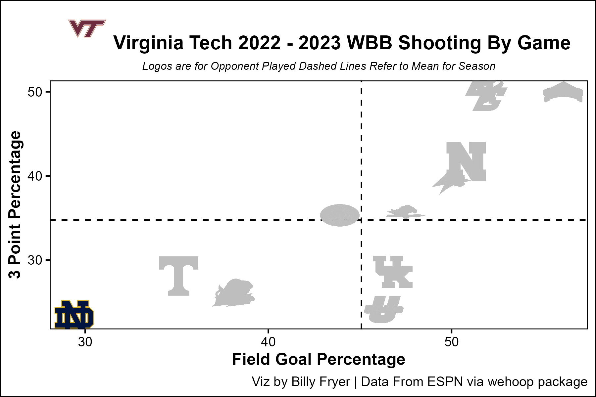
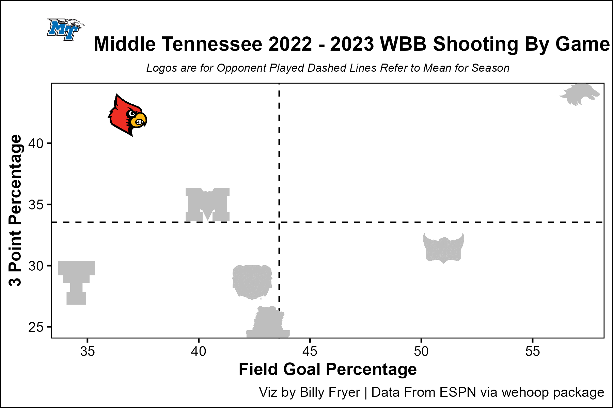
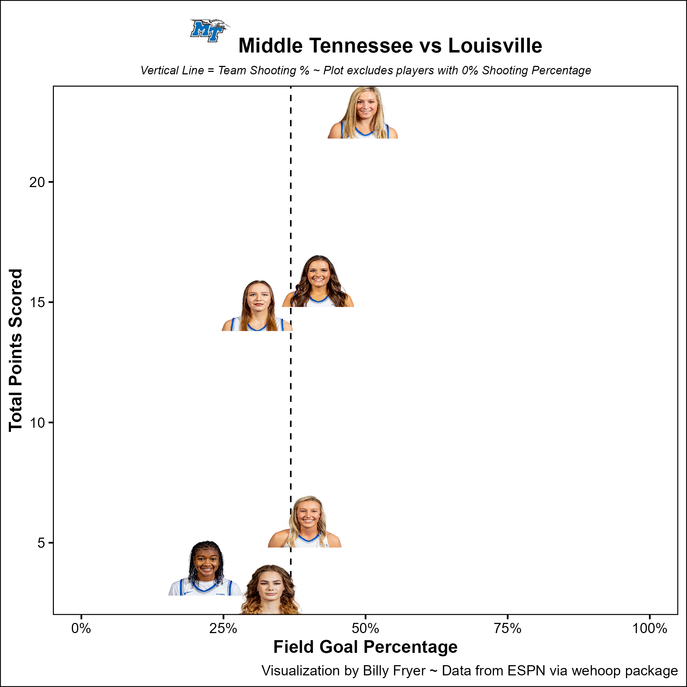
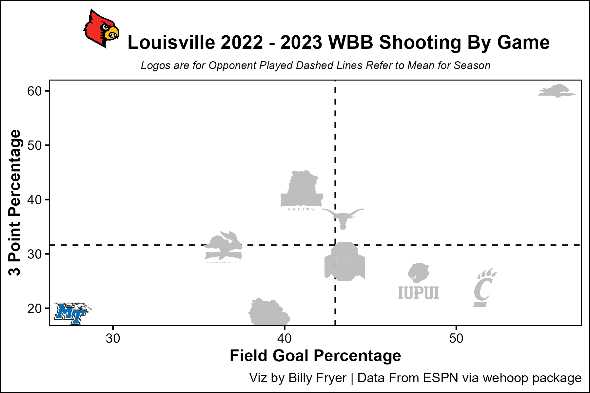
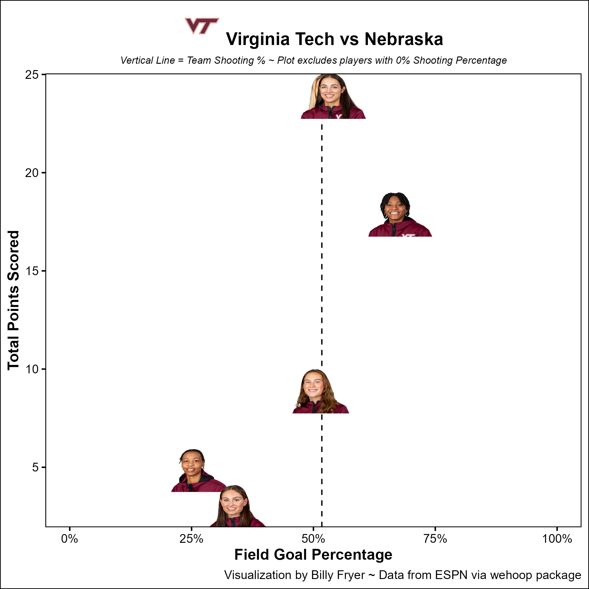
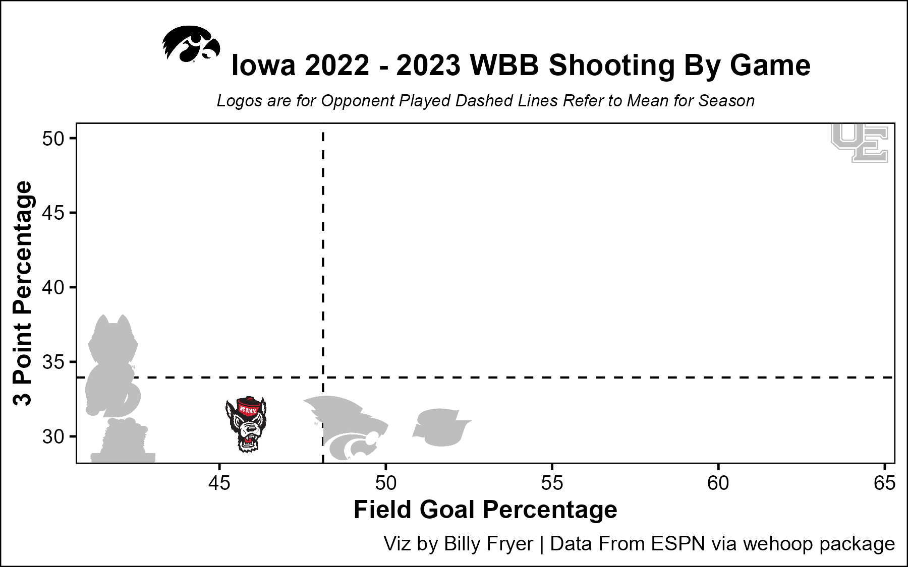
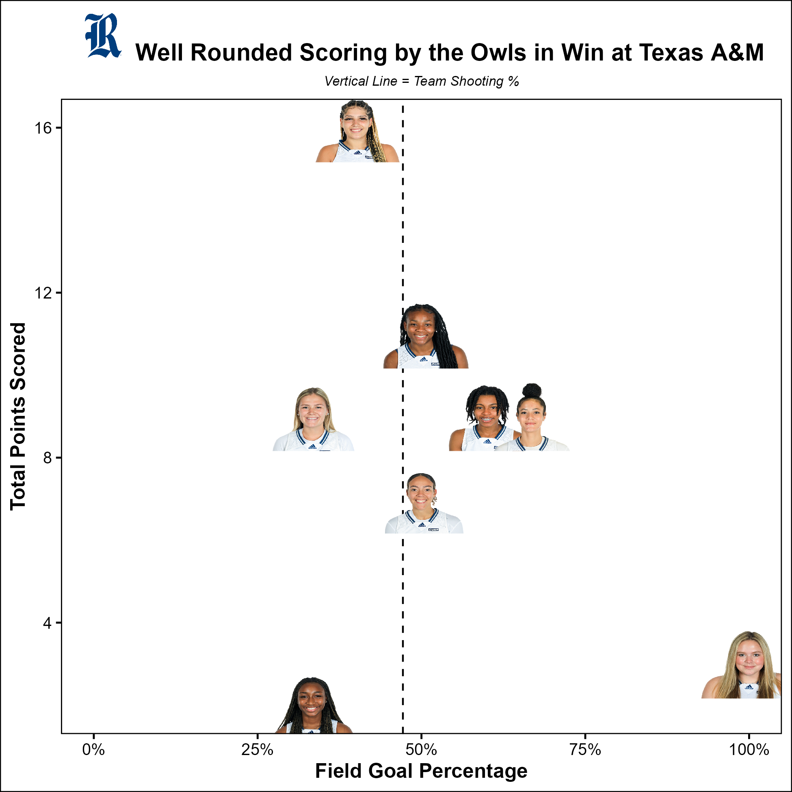

# Duke WBB
## December 29, 2022

Tobacco Road upset for Duke WBB  coached by Kara Lawson absolutely lighting it up from 3 shooting 64% including Celeste Taylor going 5-6 from 3 and Elizabeth Balogun shooting 100% from the floor and ft line.

# Notre Dame
## December 18, 2022

The key to Notre Dame's win over Virginia Tech was holding the Hokies to their worst shooting performance of the season to date.

# Middle Tennessee State
## December 4, 2022

Conference USA has looked great so far this season. MTSU WBB upset Louisville behind a huge 3 point shooting night. Courtney Whitson contributed a Double Double and Sav Wheeler had 23 against the Cardinals.

What's agruably more impressive is the Blue Raider's Defense. The held Louisville to (at the time) season lows in shooting and 3 Point Percentage. Almost breaking the chart low. Adding this win to the one over Belmont, MTSU definitely deserved AP Poll votes at the time.

# Virginia Tech
## December 2, 2022

The Queens of Cassell showing early signs of being a strong force in the ACC this year. Georgia Amoore led the Hokies with a program first Triple Double. However, similar to the graphic, Liz Kitley had an almost hidden 24 points to dominate the Huskers.

# NC State
## December 2, 2022

Fantastic defense by the Pack at # 10 Iowa. Kept the Hawkeyes to one of their worst shooting games of the season so far

# Rice WBB
## November 27, 2022

Fantastic game by Rice WBB over Texas A&M. Only 2 players with double figures in scoring, but 3 more contributed 9 points each to pull off the upset